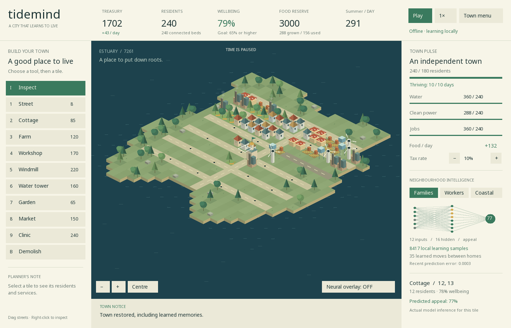

# Tidemind

A playable, offline **C++20 city builder** where a small neural network learns
what makes a neighbourhood a good home.

Build an isometric estuary town, connect its streets, balance food, water,
energy, jobs and money, and grow from 24 settlers to an independent town.
Different households value gardens, employment and the coast differently.
Their learned preferences determine where they move.



## Play

On macOS, install the build tools and graphics libraries once:

```sh
brew install cmake sdl2 sdl2_ttf
```

Then double-click **Launch Tidemind.command**, or run:

```sh
cmake -S . -B build -DCMAKE_BUILD_TYPE=Release
cmake --build build --parallel
./build/tidemind
```

On Ubuntu/Debian, install `build-essential cmake libsdl2-dev libsdl2-ttf-dev`,
then use the same CMake commands. Requires SDL2 2.0.18 or newer and SDL2_ttf.
No account, model download, GPU compute library, API key or internet connection
is needed to play. A redistributable font is included.

The initial tutorial explains the objective. The game starts paused, so you can
plan before starting time. An existing save is restored automatically, paused.

## Build a thriving town

- **Streets** connect buildings to the town hall. A building must touch the hall
  or a connected street; buildings do not pass the street connection onward.
- **Cottages** house 12 residents each. Arrivals choose available connected homes
  using neural predictions; poor living conditions cause residents to leave.
- **Farms** produce up to 32 food/day. Each resident consumes 0.65/day. Farms
  yield 35% less during winter, and water shortages reduce production.
- **Water towers** supply 90 residents; **windmills** supply 72. Connected
  residents share these capacities. Low power reduces effective jobs.
- **Workshops** provide 24 jobs but make nearby homes less pleasant.
  **Markets** provide 12 jobs and trade income, reduced by utility shortages.
- **Gardens** improve homes within four tiles, and **clinics** within six.
  Clinics also provide eight jobs. Distances use the street-grid coordinates.
- **Taxes** fund the town but reduce its appeal. The treasury also receives a
  12 coin daily civic grant. Every built structure has upkeep, even if it is
  disconnected. Demolition returns one-third of the construction price.
- Forest clearing costs 10 extra coins; rock clearing costs 20. Water is not
  buildable. The town hall cannot be removed.

Village milestones at 40, 100 and 180 residents each award 250 coins once.
To win, sustain **180 residents, 65% wellbeing, sufficient food production,
water and power, nonnegative cash, and income covering upkeep for 10 days**.
You can continue building after independence. Spending ten consecutive days
below −500 coins ends the campaign; restart or restore a previous save.

A reliable opening is more cottages, a second farm, and a market. Expand
utilities and jobs alongside housing, keep gardens near homes, and prepare
surplus food before winter. The council briefing identifies immediate shortages;
the journal shows recent events, income, upkeep and population history.

## Controls

| Action | Control |
| --- | --- |
| Choose / place building | Left mouse button |
| Paint streets | Select Street, hold and drag left mouse |
| Inspect | `I`, or right-click a tile |
| Building tools | `1`–`9`, matching the sidebar |
| Demolish | `B`, then click a building |
| Pan | `WASD`, arrows, or middle-mouse drag |
| Zoom | Mouse wheel or on-screen `+` / `−` |
| Centre map | `Home` or Centre button |
| Pause / resume | `Space` |
| Speed | Top speed button, `+` to cycle 1×/2×/4×, `−` to slow |
| Neural appeal overlay | `Tab` |
| Town journal | `J` |
| How to play | `H` |
| Menu | `Esc` |
| Save | `F5` |
| Load | `F9`, then confirm replacement |

Mouse input scales with the resizable window. Use the tile's ground footprint
when placing or selecting; a tall building can extend over tiles behind it.

## Saving

The game maintains one local save slot: `town.save` in SDL's application data
folder. On macOS this is normally
`~/Library/Application Support/Tidemind/Tidemind/`; on Linux it is beneath
`$XDG_DATA_HOME/Tidemind/Tidemind/` (usually `~/.local/share/`).

Save manually with F5. Autosave runs every 30 game days and closing the window
saves too. The menu offers Save and quit, or a confirmed Quit without saving.
Starting a new island and loading a save require confirmation in the game.

Saves contain the full map, resident cohorts, economy, campaign progress,
random-generator state, neural weights, learning statistics and recent history.
Writes use a temporary file followed by rename; damaged or unsupported files
are rejected without replacing the current town. Back up the save file if you
want multiple branches of a town.

```sh
./build/tidemind --seed 123 --save /tmp/my-new-town.save
```

The seed generates a new town when that save does not already exist. If it does
exist, it is restored. Use a different save path to keep multiple towns.

## What the neural AI does

The native **12 → 16 → 1** network uses tanh hidden units, a sigmoid output and
online backpropagation. It predicts neighbourhood appeal for three household
cohorts. Actual arrivals choose the highest-scoring eligible cottage, and
existing residents may move when the predicted improvement exceeds 0.05.

It starts with 6,000 reproducible synthetic training experiences, then learns
from the simulated wellbeing of occupied homes every game day. Weights and
training state survive saving. The inspector shows predictions, hidden-unit
activations, local sample count, mean squared prediction error and relocation
count. The overlay colours homes by predicted appeal for the selected cohort.

This is a small supervised simulation model, not a language model or a claim
of human intelligence. **The council briefing is rule-based**; the neural
network controls resident housing choices. See [AI details](docs/AI.md).

## Verification and development

```sh
ctest --test-dir build --output-on-failure
./build/tidemind --smoke-test
```

CTest covers seeded generation, construction and road connectivity, resource
failure, bankruptcy and restart, exact learned-state persistence, deterministic
continuation, backpropagation, and a complete campaign played using the normal
starting money and construction API. A controlled test changes only the neural
weights and verifies that residents choose opposite homes.

The interface test injects keyboard and mouse events through SDL to build,
save, demolish and restore a cottage, open the journal, toggle the overlay,
and run/pause the actual simulation timer. It uses SDL's dummy display in CI;
the same test also runs against a real native window.

```sh
cmake -S . -B build-sanitize -DTIDEMIND_GUI=OFF \
  -DTIDEMIND_SANITIZE=ON -DCMAKE_BUILD_TYPE=Debug
cmake --build build-sanitize --parallel
ctest --test-dir build-sanitize --output-on-failure
```

The simulation and neural network have no SDL dependency. `TIDEMIND_GUI=OFF`
builds them and their tests without any third-party library. CI builds and
checks macOS and Linux. Windows packaging is not provided.

- [Why this concept fits the existing repositories](docs/CONCEPT.md)
- [Verification record](docs/VERIFICATION.md)
- [Asset provenance and font license](assets/README.md)

## Source layout

`src/simulation.*` owns the town and persistence; `src/neural.*` owns inference
and learning; `src/ui.cpp` owns SDL rendering and input; `src/main.cpp` handles
launch options. `tests/core_tests.cpp` includes the reproducible campaign plan.
All graphics are original procedural geometry, apart from the open-licensed
bundled typeface. This is a compact single-player game; it does not currently
include multiplayer, social synchronisation, audio or mod support.
